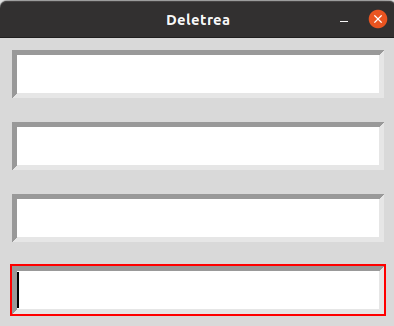
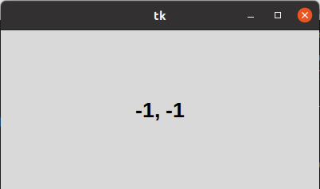
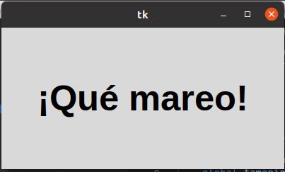

# 3. METODOS COMUNES

# Gestor de metodos comunes foco

### Este gestor de metodos comunes hace un ciclo de arriba hacia a bajo entre los cuantro rectangulos y al estar en uno de los rectaculos brilla los bordes.

# Gestor de metodos comunes raton

### Este gestor de metodos comunes que le da coordenadas de la pocicion del roton en la pantalla.

# Gestor de metodos comunes temporizadores

### Gestor de metodos comunes que engrandece y empequeñese un comentario en espesifico.

